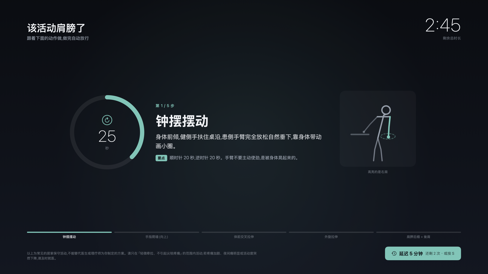
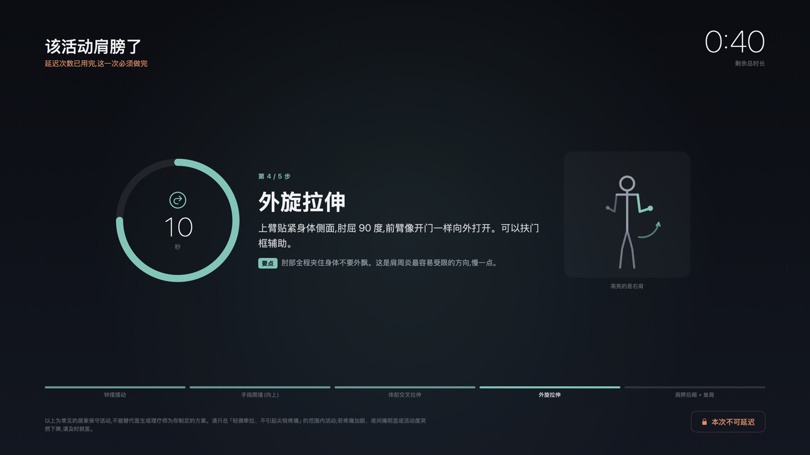
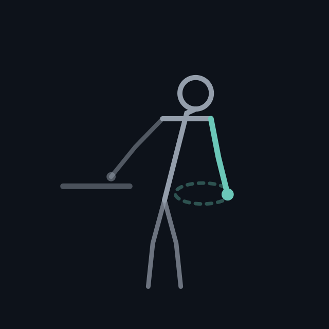
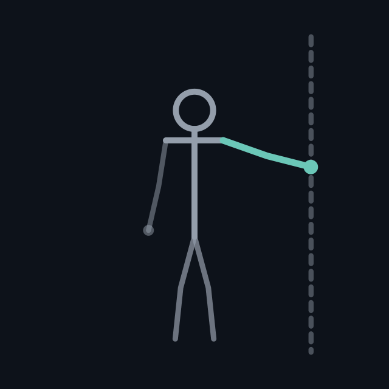
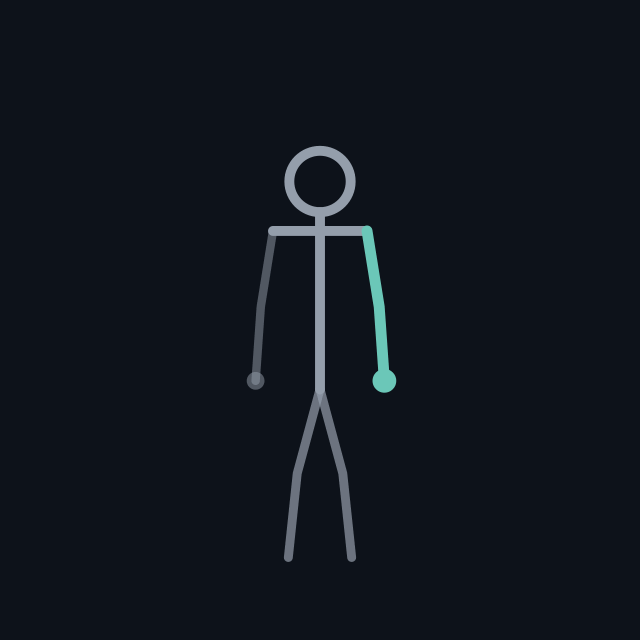
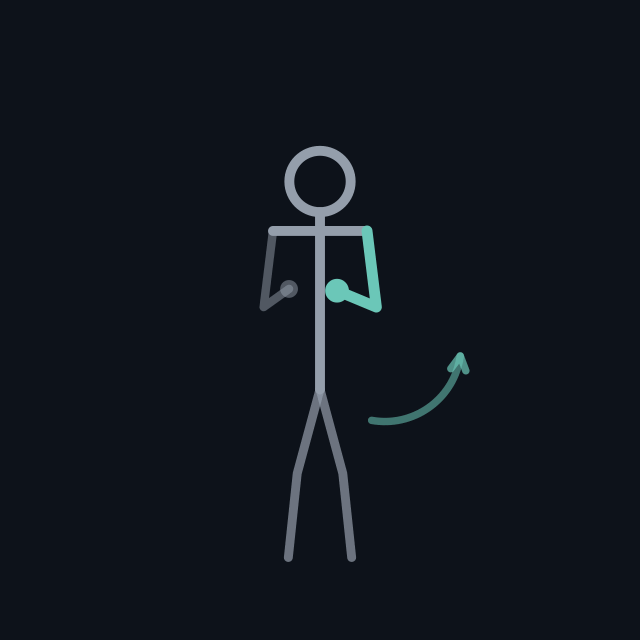
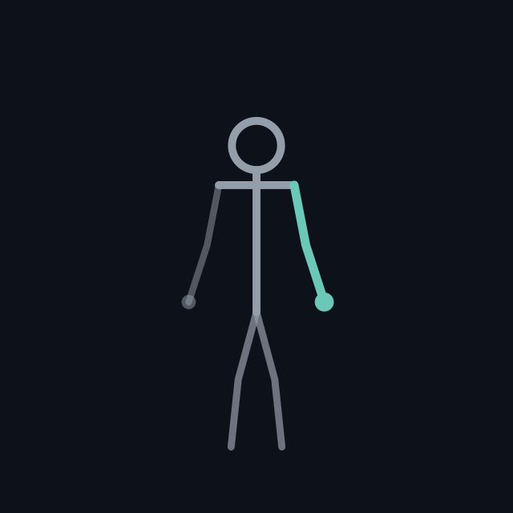

# ShoulderBreak

Mac 上的**强制**肩周活动提醒。到点用全屏黑幕盖住所有屏幕,封掉切换应用的操作,
按分步指引做完肩部动作才放行。可以延迟,但延迟有配额。

不是又一个能随手点掉的通知——那种等于没有。





## 它做什么

- 每 45 分钟(可配)在**每一块屏幕**上盖全屏黑幕
- 黑幕层级用 macOS 的**屏蔽窗口层级**(屏保和登录界面用的那一档),全屏视频、全屏 IDE 都压得住
- 同时开启系统**展台模式**(kiosk mode,苹果给公共展示机用的一组开关),封掉
  Cmd+Tab 切应用、Cmd+Opt+Esc 强制退出、Dock、顶部菜单栏
- 黑幕上是 5 个动作的分步指引,每步单独倒计时,默认总共 3 分钟
- 前 3 次可以点「延迟 5 分钟」(也可以直接按 **S** 键);**配额用完后两者都失效**,只能做完

## 贴心的地方

| 行为 | 为什么 |
|---|---|
| 黑幕前 20 秒右上角弹预告横幅 | 让你把手上这行字打完,而不是屏幕突然一黑 |
| 3 分钟没碰键鼠就跳过本次 | 你已经离开电脑了,本身就是在休息,不该等你一回座位就黑屏 |
| 屏幕锁着 / 切了用户就不弹 | 人根本不在,弹了只会留下一堆「做过了」的假记录 |
| 合盖睡眠期间错过的不补弹 | 睡了两小时不会醒来连弹三次 |
| 菜单栏可「暂停 1 小时」 | 开会、演讲、录屏时用 |
| 生效时段外不打扰 | 默认 09:00–22:00 |
| 被 kill 掉会秒级复活并恢复黑幕 | 剩余时间接着算,杀进程只能换来几秒 |

## 安装

```bash
./install.sh
```

会做四件事:编译 → 装到 `~/Applications/ShoulderBreak.app` → 建命令行软链
`~/.local/bin/shoulder-break` → 注册 launchd 开机自启。

装完菜单栏右上角出现一个小人图标,显示距下次提醒还有几分钟。

卸载:`./uninstall.sh`(程序移到废纸篓,配置和历史记录保留)。

## 命令

```bash
shoulder-break status    # 下次时间、本轮延迟次数、今日/本周统计
shoulder-break now       # 立刻做一次
shoulder-break pause     # 暂停 1 小时
shoulder-break resume    # 取消暂停
shoulder-break panic     # 紧急解除当前黑幕
shoulder-break reload    # 改完配置后重新载入
shoulder-break quit      # 停掉服务
```

## 配置

`~/.config/shoulder-break/config.json`,改完跑一次 `shoulder-break reload`。

| 字段 | 默认 | 说明 |
|---|---|---|
| `mode` | `interval` | `interval` 按间隔;`fixed` 按每天固定钟点 |
| `intervalMinutes` | 45 | 间隔模式下多久提醒一次 |
| `fixedTimes` | 6 个时间点 | 固定钟点模式下的触发时刻 |
| `activeHours` | 09:00–22:00 | 生效时段,支持跨午夜 |
| `exerciseSeconds` | 180 | 每次强制活动时长(下限 20 秒) |
| `snoozeMinutes` | 5 | 每次延迟多久 |
| `maxSnoozes` | 3 | 每轮最多延迟几次,用完就不能延迟 |
| `preWarnSeconds` | 20 | 提前多少秒弹预告横幅,0 = 不预告 |
| `idleSkipSeconds` | 180 | 多久没碰键鼠就判定人不在、跳过本次,0 = 关闭 |
| `escapeHoldSeconds` | 10 | 长按 Esc 多少秒才能强制解除 |
| `soundEnabled` | true | 提示音 |
| `affectedSide` | `right` | 患侧是哪边:`right` / `left` / `both`,决定示意图高亮哪只手臂 |

## 黑幕上只有三个按键有用

| 操作 | 作用 |
|---|---|
| 鼠标点右下角按钮 / 按 **S** | 延迟 5 分钟(额度用完后无效) |
| 长按 **Esc** 10 秒 | 强制解除,记一次「强制跳过」 |
| 其他所有按键 | 全部被吞掉,包括 Cmd+Tab、Cmd+Q、Cmd+Opt+Esc |

S 键是给鼠标点不动时留的后路,和点按钮完全等价,强制场次里同样无效。

## 逃生阀

**长按 Esc 10 秒**可以强制解除,屏幕上有进度条。松开就取消。

留这个口子是因为软件 bug 或者你正在开重要会议时,被锁在屏幕外的代价太大。
按住 10 秒足够麻烦,不会被随手用来偷懒;每次使用都记进日志,菜单栏会显示
「本周强制跳过 N 次」。

## 做不到 100% 封死

展台模式能封住 Cmd+Tab、Cmd+Opt+Esc、Dock、菜单栏,足够挡掉所有
「下意识继续敲键盘」的动作。但以下路径系统层面挡不住:

| 逃脱路径 | 应对 |
|---|---|
| 长按 Esc 10 秒 | 主动保留的逃生阀,记账 |
| 从另一台设备 ssh 进来 kill | launchd 秒级拉回 + 从状态文件恢复黑幕,只能换来几秒 |
| 快速切换用户 / 锁屏 | 挡不住。但锁屏本身就离开电脑了,等价于休息 |
| 长按电源键硬关机 | 挡不住,也**故意不挡**——这是程序失控时的最后保险 |

这个程序的作用是制造足够强的摩擦让你不得不停下来,不是安全沙箱。

## 动作内容

黑幕上每个动作旁边都有一个**循环播放的简笔示意图**,患侧手臂高亮,配上墙、桌沿、
旋转箭头这些参照物。是代码实时画的矢量图,不是图片,所以在 5K 屏上也是清晰的。

| 步骤 | 时长 | 动作 | 示意 |
|---|---|---|---|
| 1 | 40s | 钟摆摆动(Codman) |  |
| 2 | 35s | 手指爬墙(向上) |  |
| 3 | 35s | 体前交叉拉伸 |  |
| 4 | 40s | 外旋拉伸 |  |
| 5 | 30s | 肩胛后缩 + 耸肩 |  |

改 `exerciseSeconds` 时每步会等比缩放。动作定义在 `Sources/Exercises.swift`,
示意图的画法在 `Sources/StickFigure.swift`。

**患侧默认是右肩**,示意图里高亮的就是它。要是左肩,把配置里的 `affectedSide`
改成 `"left"`(两边都不舒服就填 `"both"`)。

> 以上为常见的居家保守活动,不能替代医生或理疗师为你制定的方案。
> 请只在「轻微牵拉、不引起尖锐疼痛」的范围内活动;若疼痛加剧、夜间痛明显
> 或活动度突然下降,请及时就医。

## 文件位置

```
~/Applications/ShoulderBreak.app                    程序
~/.local/bin/shoulder-break                         命令行入口(软链)
~/Library/LaunchAgents/com.shoulderbreak.agent.plist  开机自启
~/.config/shoulder-break/config.json                配置
~/.local/state/shoulder-break/state.json            运行状态
~/.local/state/shoulder-break/history.jsonl         统计记录
~/.local/state/shoulder-break/logs/service.log      日志
```

## 开发

```bash
./build.sh                                    # 只编译,产物在 build/
./build.sh && build/ShoulderBreak.app/Contents/MacOS/ShoulderBreak run   # 前台跑

# 不占屏幕地检查界面排版(离屏渲染成 PNG)
build/ShoulderBreak.app/Contents/MacOS/ShoulderBreak preview out.png --at=95 --forced

# 导出动作示意图:GIF,或者把一圈动作摊成一排关键帧方便检查
build/ShoulderBreak.app/Contents/MacOS/ShoulderBreak figure wallwalk out.gif
build/ShoulderBreak.app/Contents/MacOS/ShoulderBreak figure wallwalk sheet.png --sheet
# 动作名:pendulum / wallwalk / crossbody / rotation / squeeze,加 --left 看镜像版
```

纯 Swift + AppKit + SwiftUI,无第三方依赖,`swiftc` 直接编译,不需要 Xcode 工程文件。

## 协议

MIT
